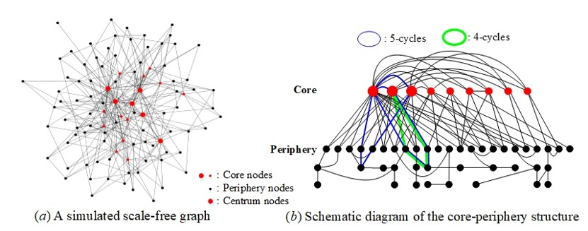

# [Ollivier-Ricci curvature in cycle overlap mode](https://doi.org/10.48550/arXiv.2606.03317)

Zexian Zhou<sup>\*</sup>, Bo Jiao<sup>\*</sup>

## Overview

Ollivier-Ricci curvature (ORC) is a structural measure that captures graph geometry and has been widely applied to tasks such as community detection and deep neural networks. This repository focuses on the overlap problem of 3,4,5-cycles on scale-free graphs.

<p align="center">
  
  <br>
  <em>Figure 1. Cycle overlap problem on the core-periphery structures.</em>
</p>

As shown in Fig. 1, the core-periphery structure of a scale-free graph is caused by the preferential attachment that preferentially attaches each newly added node to high-degree nodes. Specifically, the structure consists of a dense (small) core and a sparse (large) periphery, and the centrum of the core, composed of a few core nodes with top highest degrees, is densely connected by the periphery. Thus, there are numerous 3,4,5-cycles passing through the centrum nodes, which contribute to reducing the distance between low-degree nodes and give rise to the small-world property, namely, the core-periphery structure results in extensive overlapping of the 3,4,5-cycles.

This repository provides the source code for the paper **“Ollivier-Ricci curvature in cycle overlap mode”**. The paper studies the optimal transport principle of ORC under the cycle overlap mode and proposes **CCOM** (**Curvature in Cycle Overlap Mode**), an efficient approximation method based on cycle enumeration, pruning search, and greedy sorting. CCOM is designed to reduce curvature approximation errors on large scale-free graphs while maintaining acceptable time and memory overhead.

This repository includes implementations of CCOM and experiments on curvature approximation errors and community detection tasks.

## Highlights

- Optimal transport principle of Ollivier-Ricci curvature in cycle overlap mode
- Designing a greedy approach to approximate the optimal transport principle
- Greatly reducing the computational errors on scale-free graphs
- Acceptable time and memory overhead
- Superior performance in community detection tasks

## Directory Structure

```
CCOM/
│   README.md
│   requirements.txt
│   LICENSE
│   ...
│
├───curvatures/
│   │   __init__.py
│   │   ccom.py
│   │   mwpm.py
│   │   locur.py
│   │   curvature_computer.py
│   │   ...
│
├───experiments/
│   ├───curvature/
│   │   │   small_graph.py
│   │   │   large_graph.py
│   │   │   hk_network.py
│   │   │   ws_network.py
│   │   │   time_mem.py
│   │   │   ...
│   │
│   └───community_detection/
│       │   curvature_community_detection.py
│       │   small_graph.py
│       │   large_graph.py
│       │   visualize_dolphins.py
│       │   visualize_football.py
│       │   ...
│
├───data/
│   ├───datasets/
│   │   │   ...
│   │
│   └───exact_curvatures/
│       │   ...
│
└───figures/
    │   ...
```

## Setup

#### Core Dependencies

- Python 3.11
- networkx
- numpy
- scipy
- numba
- matplotlib
- seaborn
- pandas
- GraphRicciCurvature
- POT
- cdlib
- python-louvain
- scikit-learn
- tqdm
- torch
- torch-geometric

`GraphRicciCurvature` is used to compute exact ORC, but it only runs in Linux environments.

#### Installation

Install the core dependencies with:

```
pip install -r requirements.txt
```

This command installs the essential packages, and their indirect dependencies will be installed automatically. If you encounter an error caused by a missing package, you can manually install it. For strict environments, see `requirements-lock.txt`.

## Datasets

This repository contains experiments on both real-world and synthetic networks. These datasets are available in [Stanford Network Analysis Project](https://snap.stanford.edu/data/), [PyTorch Geometric](https://pytorch-geometric.readthedocs.io/en/latest/modules/datasets.html), [Network Repository](https://networkrepository.com/), [Mark Newman’s personal website](https://public.websites.umich.edu/~mejn/netdata/) and `NetworkX`. All datasets are converted into undirected, unweighted and simple graphs.

The datasets are stored in: `data/datasets/`.

## Exact ORC

Since `GraphRicciCurvature` only runs in Linux environments, we provide precomputed files containing the exact ORC values. These files are stored in `data/exact_curvatures/`. If you prefer to compute the exact ORC yourself using `GraphRicciCurvature` rather than using the precomputed files, simply delete the corresponding files under `data/exact_curvatures/`. In that case, the code will automatically call `GraphRicciCurvature`.

## Curvature Experiments

The scripts for curvature experiments are stored in: `experiments/curvature/`.

#### Small graph experiment

```
python experiments/curvature/small_graph.py
```

This experiment evaluates CCOM on small graphs, reporting the results in terms of MAE, MRE, and Mean (as defined in the main paper).

Output (Karate):

```
========== Curvature Approximation Results ==========
  Methods      MAE      MRE      Mean
     CCOM 0.001246 0.017123  0.005475
     MWPM 0.158652 1.288185 -0.151930
    LoCur 0.400530 4.232318 -0.393809
      ALU 0.158205 1.738352 -0.110521
Exact ORC      NaN      NaN  0.006721
```

#### Large graph experiment

```
python experiments/curvature/large_graph.py
```

This experiment evaluates CCOM on large graphs, reporting the results in terms of Mean.

Output (com-Amazon):

```
========== Curvature Approximation Results ==========
Methods      Mean
   CCOM -0.254910
   MWPM -0.441341
  LoCur -0.553929
    ALU -0.182604
```

#### HK and WS network experiment

```
python experiments/curvature/hk_network.py
python experiments/curvature/ws_network.py
```

These experiments investigate how the errors of different curvature approximation methods change as the size of the HK or WS network increases. The resulting figures are saved in the `figures/` folder.

## Community Detection Experiments

The scripts for community detection experiments are stored in: `experiments/community_detection/`.

#### Small graph experiment

```
python experiments/community_detection/small_graph.py
```

This experiment uses ARI and AMI to evaluate community detection performance. **Adjusted Rand Index (ARI)** measures the agreement between two partitions based on node pairs, ranging from -1 to 1, where 1 indicates perfect agreement. **Adjusted Mutual Information (AMI)** measures the shared information between two partitions while adjusting for chance, ranging from 0 to 1, where 1 indicates complete agreement.

Output (Polbooks):

```
========== Community Detection Results ==========
Curvatures      ARI      AMI
       LRC 0.446009 0.425450
       FRC 0.432213 0.462254
       BFC 0.446009 0.425450
     LoCur 0.439584 0.450760
       ALU 0.446603 0.454915
      MWPM 0.500865 0.489350
      CCOM 0.674510 0.565186
```

#### Large graph experiment

```
python experiments/community_detection/large_graph.py
```


This experiment uses F1-score to evaluate community detection performance. **F1-score** combines precision and recall into a single metric and ranges from 0 to 1, where 1 indicates perfect performance. It is suitable for evaluating mixed-membership communities.

Output (com-LiveJournal):

```
========== Community Detection Results ==========
Curvatures  F1-score
       LRC  0.857711
       FRC  0.837900
     LoCur  0.853830
       ALU  0.856186
      MWPM  0.792272
      CCOM  0.887755
```

#### Visualization

```
python experiments/community_detection/visualize_dolphins.py
python experiments/community_detection/visualize_football.py
```

These experiments visualize community detection results on the Dolphin and Football datasets. The resulting figures are saved in the `figures/` folder.

## License

Copyright (c) 2026 Zexian Zhou.

This project is licensed under the [MIT License](LICENSE).


